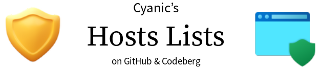

  
   
  Get rid of those unnecessary ads, telemetry and companies you don't like.
    
  
  
  

  

> <b>Maintenance Announcement</b> 
> The GitHub mirror repository will be archived on 2024-01-01. 
> <a href="https://r.cyanic.me/answer/5">Learn more</a>

# About

The [main list](https://hosts.cyanic.me/cyanicHosts.txt) includes **2000**+ telemetry, advertisements, annoyances and other unnecessary hosts.

# You choose what to block.

There's **40**+ files for you to choose from: annoyances, companies, cookie banners & more!

# Contributing

Request new hosts to be added to the lists! 

The <a href="https://codeberg.org/Cyanic76/Hosts/wiki/Contributing">Contributor's Guide</a> applies.

# Do & Don't

No maintainer is liable for any damage. You may use Codeberg Issues to report any broken website. [Don't Be Evil](https://r.cyanic.me/answer/4)

---

Maintained by [Cyanic76](https://cyanic.me).
